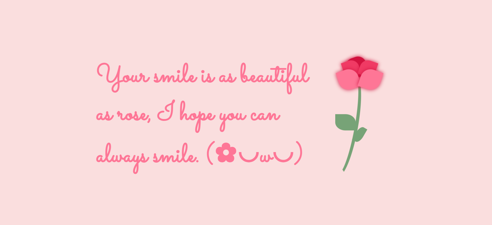
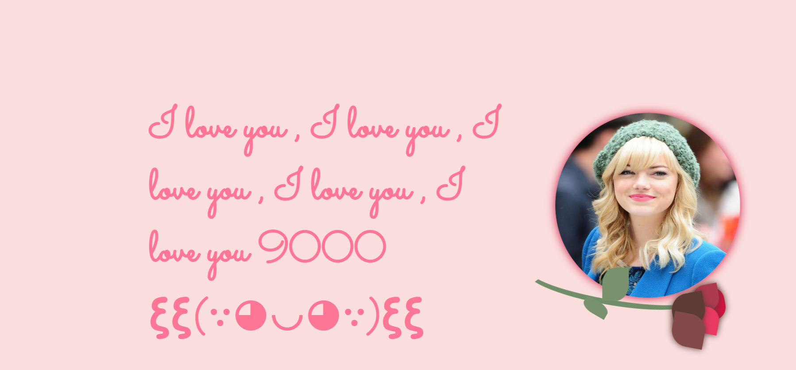
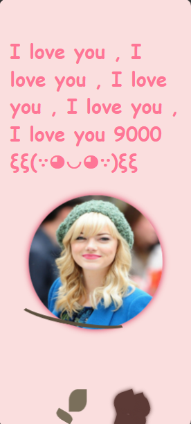
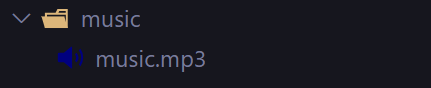
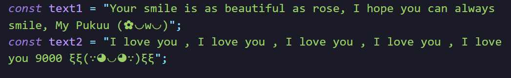

# 🌹 Click the Rose to Reveal Your Love 💕

[Live Demo: https://arundada9000.github.io/Flower-with-Message/](https://arundada9000.github.io/Flower-with-Message/)

## Desktop preview




---

## Mobile Preview

<p align="center">



</p>
---

A romantic and playful experience where a simple click turns a blooming rose into a heartfelt surprise 🌷 — revealing **her photo** and showing how even the most beautiful rose fades before her charm 💖.

---

## 🛠️ How to Customize It

### 🌸 Change the Image


1. Go inside the `assets` folder.
2. Paste your new image there.
3. Delete the existing **`image1.jpg`** file.
4. Rename your new image to **`image1.jpg`**.

✅ Done! Your new image will now appear when the rose is clicked.

---

### 🎧 Change the Music



1. Go inside the `music` folder.
2. Paste your new music file there.
3. Delete the existing **`music.mp3`** file.
4. Rename your new file to **`music.mp3`**.

🎶 That’s it! Your chosen soundtrack will now play as your love story unfolds.

---

### 💬 Update the Text Messages



There are **two messages** in this project:

- One **before** the photo appears.
- One **after** the photo appears.

You can find and edit them at the bottom of the `index.html` file inside the `<script>` tag:

```js
const text1 = "Your first message here 💌";
const text2 = "Your second message here 🌹";
```

```js
const text1 = "A rose for you, my love 🌷";
const text2 = "Even this rose fades in your beauty 💖";
```

### 🌐 Connect with Me

I'm always open to collaborating on interesting projects or just chatting about tech!
Feel free to reach out through any of the platforms below:

[](mailto:arunneupane0000@gmail.com)
[](https://youtube.com/@arundada9000)
[](https://instagram.com/arundada9000)
[](https://facebook.com/arundada9000) [](https://github.com/arundada9000)

_Made with ❤️ and a bit of Rose._

_I couldn’t send it to her, I hope you can 😁😁_

Made By **Arun Neupane**
**For educational purpose** on **code_with_ease** youtube channel.

I hereby declare anybody can use this code to their liking, but i donot give any permission over images , music or names used in this code so keep that in mind.

_Couldn't edit it ?_
**Tutorial Link**: https://youtu.be/wYEz08XS6bw
My youtube channel : https://youtube.com/@arundada9000


